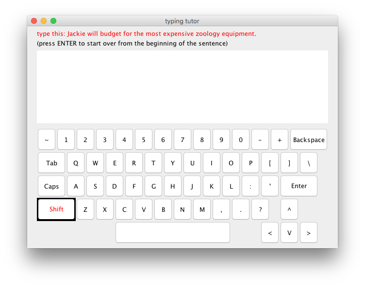

# Project: TypingTutor

Student: 401410081 Jovy Cheng

Introduction
------------

This program helps users learn to "touch type". Users will be randomly given a pangram from a set of pangrams to type.
All key pressess are displayed with a virtual keyboard on the screen, and the character input is shown in a textarea.
To start over again from the beginning of the pangram, users can hit ENTER key, practicing more.
After closing the TypingTutor window, a plain-text report file will be created in the same directory.
Users can see which keys they have difficulty with and also the number of correct/incorrect keystrokes.

How to run the program
----------------------

Thanks to the Makefile, we can easily compile and run the program with simple commands.
To compile the program, use `$make` to help you.
And to run the program, `$make run` will do the trick.
Simply close the TypingTutor window will stop the app. After you close the window, the typing assessment report will be saved as a plain-text file, `TypingTutor-AssessmentReport-Month-Day-Hour-Minute`, where the current local time will be at the end of the file name.
As for cleaning up, use `$make clean` to do so.

The implementation
------------------

For the GUI, the instruction and hint on top of the screen are `JLabel`s, the text display is a `JTextArea`, and the virtual keyboard is a `JPanel` with many `JButton`s in it.
The `TypingTutor` class implements the interface `KeyListener`, and therefore we have three methods `keyTyped()`, `keyPressed()`, and `keyReleased()` to help us monitor the `KeyEvent`s. In `keyTyped()`, the character is appended to the `JTextArea` and also, the class `TypingAssessment` is used to help assessing the users’ typing as well as generate the final report; in `keyPressed()`, we highlight the corresponding virtual key on the screen, and in `keyReleased()`, we undo the highlight.

 

The screenshot above is the TypingTutor GUI, the pangram required is indicated in red on top, and it is picked randomly from a set of pangrams. And we can infer that the SHIFT key is being pressed since the pressed keys will have black background and red forground before they are released.
